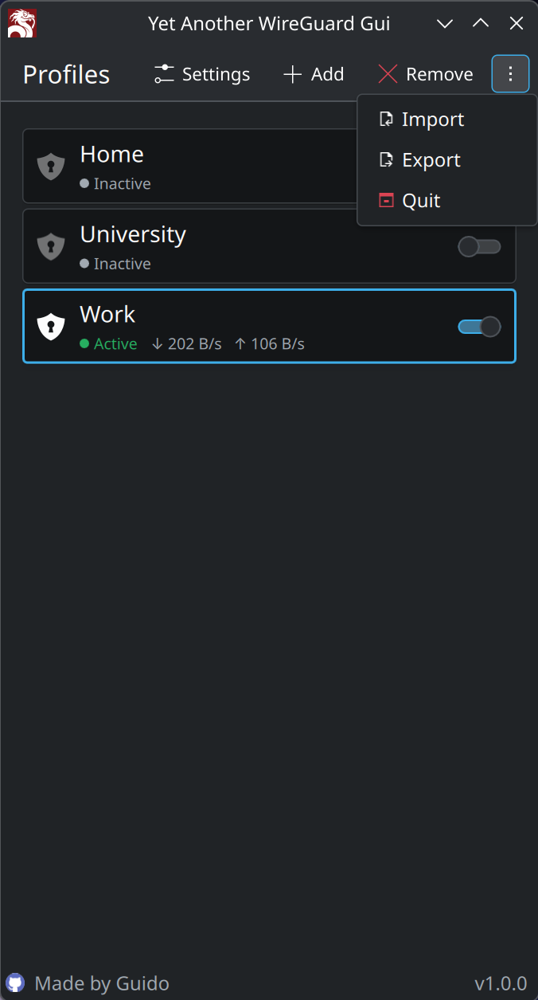
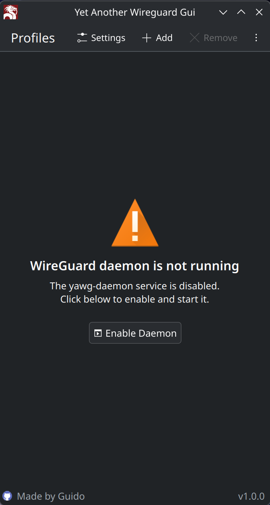
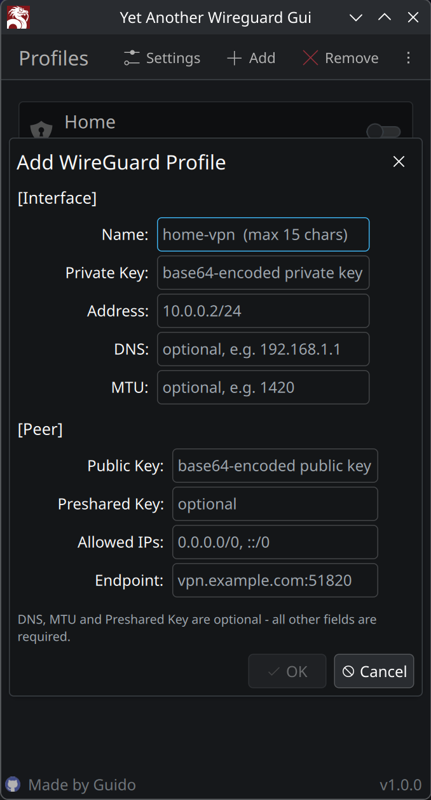
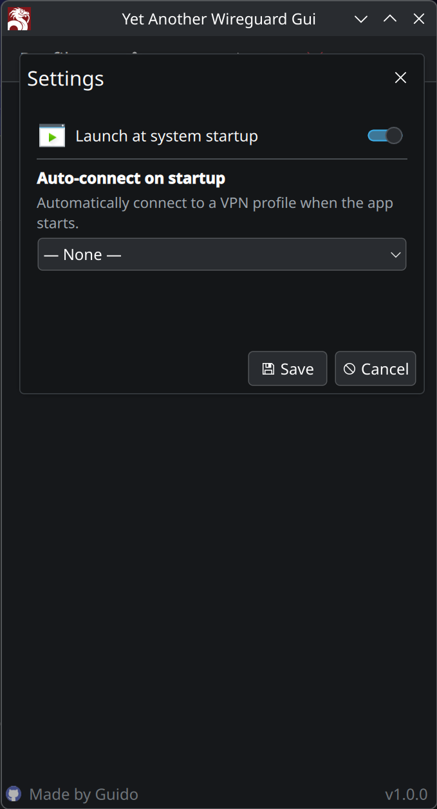

<h1 align="center">
  
  <br>
  Yet Another WireGuard GUI
</h1>

<p align="center">
  A KDE Plasma frontend for WireGuard VPN management - privilege-separated architecture with a root daemon and Kirigami UI communicating over D-Bus.
</p>

<p align="center">
  <strong>Tested on:</strong> Fedora 43 · KDE Plasma (Wayland)
</p>

---

## Screenshots

<table align="center">
  <tr>
    <td align="center"><br/><em>Home</em></td>
    <td align="center"><br/><em>Launch inactive daemon</em></td>
  </tr>
  <tr>
  <td align="center"><br/><em>Add WireGuard configuration</em></td>
  <td align="center"><br/><em>Application Settings</em></td>
</tr>
</table>

---

## Motivation

WireGuard is a fast, modern VPN protocol - but managing it on Linux typically means editing config files manually and running `wg-quick` as root. No GUI, no profile switcher, no system tray.

Yet Another WireGuard GUI fills that gap for KDE Plasma users. A privileged system daemon handles the actual WireGuard operations while the user-facing Kirigami interface communicates with it over D-Bus. PolicyKit ensures only authorized users can connect or modify profiles - no permanent root access needed.

---

## Features

| Feature | Description |
| --- | --- |
| Profile management | List, add, import, export, and delete WireGuard configuration profiles |
| One-click connect/disconnect | Toggle any profile on or off directly from the UI |
| Auto-connect on startup | Automatically connect a chosen profile when the daemon starts |
| System tray | Minimize to tray; restore or quit from the tray menu |
| Autostart | Optional autostart with the session; launches hidden (`--tray`) via a `.desktop` file at `~/.config/autostart/` |
| Privilege separation | Root daemon + unprivileged GUI; PolicyKit authorizes sensitive operations |

---

## Architecture

```
┌─────────────────┐        D-Bus (system bus)        ┌──────────────────┐
│   yawg-gui      │ ◄──────────────────────────────► │   yawg-daemon    │
│  (Kirigami UI)  │                                  │  (runs as root)  │
└─────────────────┘                                  └──────────────────┘
         │                                                     │
         │  PolicyKit authorization                            │ wg-quick
         └─────────────────────────────────────────►  /etc/wireguard/*.conf
```

The daemon exposes `io.github.traciges.WireguardManager` on the system D-Bus. The GUI proxy authenticates via PolicyKit before any privileged call.

---

## Dependencies

| Dependency | Purpose | Package (Fedora) |
| --- | --- | --- |
| `wireguard-tools` | WireGuard kernel interface (`wg`, `wg-quick`) | `wireguard-tools` |
| Qt6 Base & Declarative | Application framework | `qt6-qtbase`, `qt6-qtdeclarative` |
| KF6 Kirigami | UI framework | `kf6-kirigami` |
| polkit / polkit-qt6 | Privilege authorization | `polkit`, `polkit-qt6-1` |

---

## Hardware & OS Compatibility

Developed and tested on:

- **OS:** Fedora 43
- **Desktop:** KDE Plasma (Wayland)

Any Linux distribution with Qt6, KF6 Kirigami, and polkit should work. WireGuard kernel support is required (Linux 5.6+ includes it by default).

---

## Installation

### Install from GitHub Releases

Download the RPM from the [GitHub Releases](https://github.com/Traciges/Yet-Another-Wireguard-Gui/releases) page:

```bash
sudo dnf install ./yet-another-wireguard-gui-0.1.0-1.x86_64.rpm
```

The daemon is enabled and started automatically after installation.

### Build from source

#### 1. Install build dependencies

**Fedora:**

```bash
sudo dnf install \
    cmake ninja-build extra-cmake-modules \
    qt6-qtbase-devel qt6-qtdeclarative-devel \
    kf6-kirigami-devel \
    polkit-qt6-1-devel
```

**Arch Linux:**

```bash
sudo pacman -S --needed \
    cmake ninja extra-cmake-modules \
    qt6-base qt6-declarative qt6-tools \
    kirigami polkit-qt6
```

**Ubuntu 24.04:**

```bash
sudo apt install \
    cmake ninja-build extra-cmake-modules \
    qt6-base-dev qt6-declarative-dev \
    libkf6kirigami-dev \
    libpolkit-qt6-1-dev
```

#### 2. Build & install

```bash
git clone https://github.com/Traciges/Yet-Another-Wireguard-Gui
cd Yet-Another-Wireguard-Gui
mkdir build && cd build
cmake .. -GNinja -DCMAKE_BUILD_TYPE=Release
ninja
sudo ninja install
```

#### 3. Enable the daemon

```bash
sudo systemctl enable --now yawg-daemon
```

### Uninstall

**Fedora / RPM-based:**

```bash
sudo dnf remove yet-another-wireguard-gui
```

---

## Contributing

Contributions are welcome. Open an issue or pull request on GitHub.

---

## License

This project is licensed under the [GNU General Public License v3.0](LICENSE).
